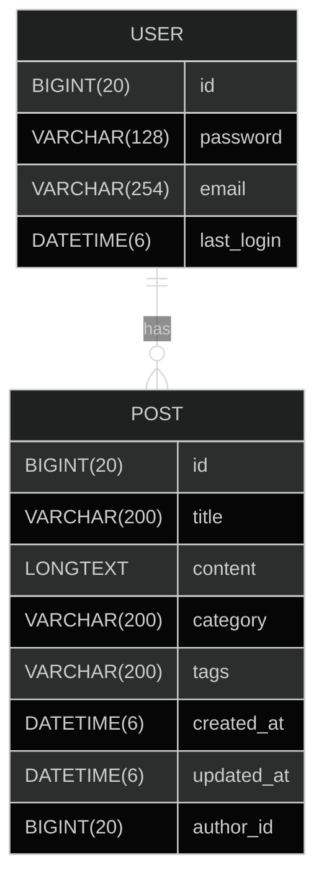

# Database models

The following represents the db's schema for the mentioned models
(as there are some other models managed by django):

```mermaid
%%{init: {'theme':'dark'}}%%
erDiagram

USER ||--}o POST : has
%% This one has to be done backwards for somereason (smh)

USER {
    BIGINT(20) id
    VARCHAR(128) password
    VARCHAR(254) email
    DATETIME(6) last_login
}

POST {
   BIGINT(20) id 
   VARCHAR(200) title
   LONGTEXT content
   VARCHAR(200) category
   VARCHAR(200) tags
   DATETIME(6) created_at
   DATETIME(6) updated_at
   BIGINT(20) author_id
}


```

